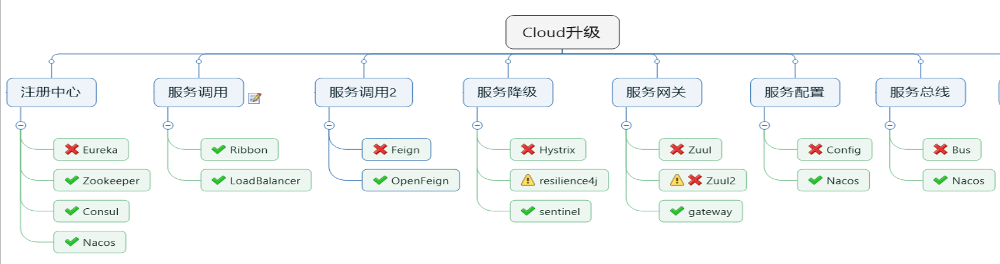

# scloudnacos
参考资料

https://segmentfault.com/a/1190000041945432
https://github.com/alibaba/spring-cloud-alibaba/wiki/Nacos-discovery

nacos控制台

http://127.0.0.1:8848/nacos/#/serviceManagement?dataId=&group=&appName=&namespace=&namespaceShowName=&serviceNameParam=&groupNameParam=

测试接口

http://127.0.0.1:8004/echo/app-name

========================================

        1、注册中心组件不再使用 Eureka，可以使用 Zookeeper 进行替换（保守方式），还可以使用 Consul 进行替换（不推荐），还可以使用 Nacos 进行替换（强烈推荐）。

        2、服务调用组件不再使用 Ribbon，但是官方还在用它，未来可能会使用 LoadBalancer 进行替换。

        3、服务调用组件不再使用 Feign，现在使用 OpenFeign 进行替换。

        4、服务降级组件不再使用 Hystrix，国外推荐使用 resilience4j，但是国内用的人很少，国内推荐使用阿里巴巴的 sentienl。

        5、服务网关组件不再使用 Zuul，现在推荐使用 gateway 进行替换。

        6、服务配置组件不再使用 Config，现在推荐使用阿里巴巴的 Nacos 进行替换。

        7、服务总线组件不再使用 Bus，现在推荐使用阿里巴巴的 Nacos 进行替换。
